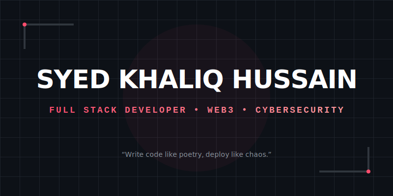

  

 

  
  
  

  <samp>
    <i>(P.S. Don't judge the commit graph... 80% of my work is in private repos 🤫)</i>
  </samp>

---

# 🚀 About Me
> 💡 **Full Stack Web & App Developer** building production-grade apps using **Next.js, React Native, & Web3**.  
> 🔐 Exploring **SAP, Cloud, Cybersecurity, & DevOps**.  
> ⚡ *Half of my life is waiting for “npm install”*

---

# ⚙️ Tech Stack

| **Frontend 🎨** | **Backend 🗄️** | **Mobile 📱** |
|:---:|:---:|:---:|
|  |  |  |

| **DevOps & Cloud ☁️** | **Web3 🔗** | **Tools 🛠️** |
|:---:|:---:|:---:|
|  |  |  |

---

# 📊 GitHub Stats

  
  

 

  

---

# 🏆 Highlights & Building

<table>
  <tr>
    <td valign="top" width="50%">
      <h3>🌟 Achievements</h3>
      <ul>
        <li>🎯 Built production apps used by real users</li>
        <li>🧩 Experienced in Full-Stack, DevOps, Mobile & Web3</li>
        <li>⭐ Active Contributor to Open-Source</li>
        <li>🏅 <b>Automation Addict</b> — <i>"If I have to do it twice, I write a script."</i></li>
      </ul>
    </td>
    <td valign="top" width="50%">
       <h3>👷 Currently Building</h3>
       <ul>
        <li>🧬 <b>PrepNotes</b> — AI-powered education app</li>
        <li>🏢 <b>SAP Fiori</b> — Enterprise Launchpad Dashboard</li>
        <li>👻 <b>Stealth Startup</b> — <i>Loading...</i></li>
       </ul>
    </td>
  </tr>
</table>

---

# 🎓 Certifications

  
  
  
  

---

# ⚡ Character Stats

 
  <code>
    Code Quality.......[██████████] 100% 
    Dark Mode..........[██████████] 100% 
    Creativity.........[████████░░] 80% 
    Caffeine Level.....[██████████] 110% 
    Semicolons.........[██░░░░░░░░] 20% (Optional) 
  </code>

---

# 📌 Featured Projects

<table border="0">
  <tr>
    <td width="50%">
      <h3 align="center">🧠 PrepNotes (AI)</h3>
      

        
      

       
      

        AI-powered education tool that generates notes, quizzes, and summaries for students instantly.
          
        
      

    </td>
    <td width="50%">
      <h3 align="center">🔗 Web3 Marketplace</h3>
      

         
      

       
      

         Decentralized marketplace for trading NFTs with secure wallet authentication.
          
        
      

    </td>
  </tr>
</table>

 

  <i>Thanks for scrolling — you're officially a real one 😎</i>

